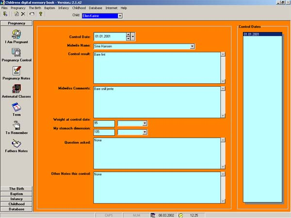



## Digital Memory Book

### Description

This is a digital version of the well-known children's memory books. Here the parents can write their thoughts from pregnancy through the Childs childhood, insert pictures, sounds and video. There is a possibility to get a print of the various parts of life as well as a complete memory book included pictures. This version is a scaled down version of my commercial sold program, using VB6 components only (the commercial is using 3. parties components), and the source code is free for you to use as you want. Please observe I have used a VB5-component: DBGrid32.ocx, which you have to install if you haven't got it already (included in the zip-file). I have used some other programmers program snippet in my code and due credit is given in the frmAbout. Please do not waste time voting for this program, but feedback is very appreciated. Have a nice day
 
### More Info
 

             |
---                |---
**Submitted On**   |2002-10-01 10:55:58
**By**             |[Jorgen Levesen](https://github.com/Planet-Source-Code/PSCIndex/blob/master/ByAuthor/jorgen-levesen.md)
**Level**          |Intermediate
**User Rating**    |5.0 (45 globes from 9 users)
**Compatibility**  |VB 6\.0
**Category**       |[Miscellaneous](https://github.com/Planet-Source-Code/PSCIndex/blob/master/ByCategory/miscellaneous__1-1.md)
**World**          |[Visual Basic](https://github.com/Planet-Source-Code/PSCIndex/blob/master/ByWorld/visual-basic.md)
**Archive File**   |[Digital\_Me14401710102002\.zip](https://github.com/Planet-Source-Code/jorgen-levesen-digital-memory-book__1-39710/archive/master.zip)

